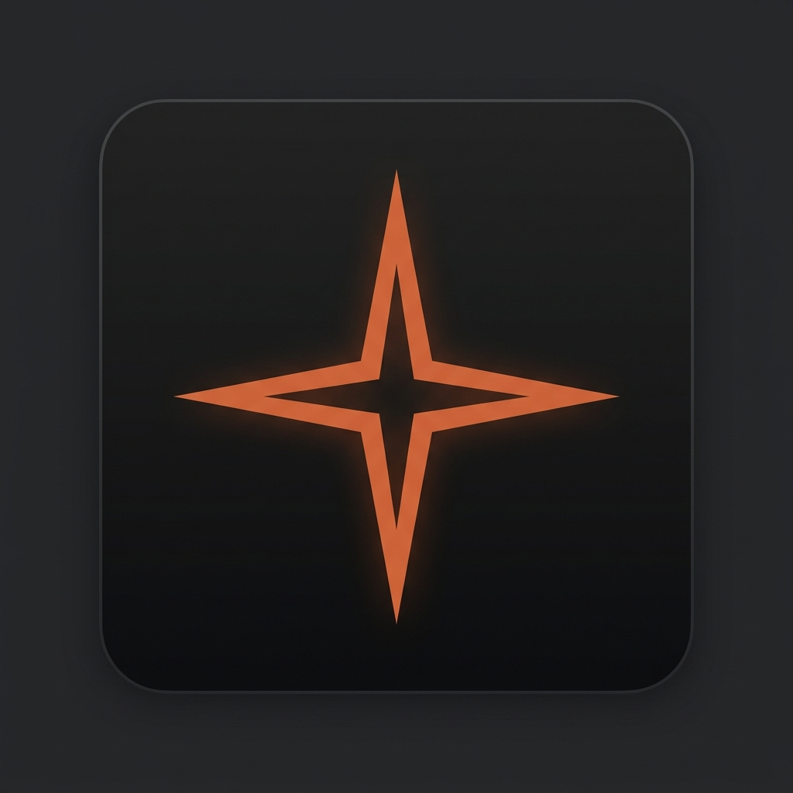

<h1 align="center">Anthropic Claude for Copilot Chat</h1>

<p align="center">
  
</p>

<p align="center">
  
  
  
</p>

<p align="center">
  English |
  <a href="README.zh-cn.md">简体中文</a>
</p>

**Pick Anthropic Claude 5 (Sonnet 5, Opus 5, Fable 5.1) with 1M Context directly in the Copilot Chat model picker — keeping all of Copilot's agent tools and UI intact.**

---

## 🌟 Overview

Love Anthropic Claude's intelligence, reasoning, and massive 1M context window, but don't want to sacrifice GitHub Copilot's agent mode, tool calling, and seamless editor integration?

This extension brings **Anthropic Claude 5 models (Sonnet 5, Opus 5, Fable 5.1)** directly into the native VS Code Copilot Chat model selector — with **1M Context Tokens**, **Custom API Key & Custom Base URL**, **CC-SWITCH Integration**, **Native Multimodal Vision**, **Extended Thinking**, and **Agent Tool Calling**.

---

## ✨ Features

### 1. Anthropic 5 Generation Models (1M Context)
- **Sonnet 5** (`claude-sonnet-5`) — High-performance flagship model with 1M tokens context.
- **Opus 5** (`claude-opus-5`) — Anthropic's deepest logic & complex reasoning model with 1M tokens context.
- **Fable 5.1** (`claude-fable-5.1`) — Advanced reasoning & creative model with 1M tokens context.

### 2. Custom API Key & Base URL (BYOK & Proxy Support)
- **Custom Base URL**: Configure `anthropic-copilot.baseUrl` (defaults to `https://api.anthropic.com`) to connect to official endpoints, One API, OpenRouter, or custom reverse proxies.
- **Secure SecretStorage**: Save your API Key or Auth Token safely via `Anthropic: Set API Key`. Stored securely in OS Keychain, never written to `settings.json`.

### 3. CC-SWITCH & Environment Variable Auto-Detection
Seamlessly compatible with **CC-SWITCH** and Claude Code developer tools:
- Automatically checks `ANTHROPIC_AUTH_TOKEN`, `ANTHROPIC_API_KEY`, `CLAUDE_AUTH_TOKEN`, and `CLAUDE_API_KEY`.
- Automatically inherits proxy URLs from `ANTHROPIC_BASE_URL`, `ANTHROPIC_API_URL`, or `CLAUDE_BASE_URL`.

### 4. Extended Thinking & Native Vision
- Full support for Claude's **Extended Thinking** (`thinking` blocks). Reasoning processes are rendered inside VS Code Copilot Chat's collapsible thinking view.
- Support for **Native Multimodal Vision** (base64 image uploads) and function calling.

### 5. Inherits Every Copilot Capability
Plugs into VS Code's native `LanguageModelChatProvider` API, preserving Copilot's full ecosystem:
- **Agent mode** — Autonomous multi-step coding tasks.
- **Tool calling** — Workspace search, file edits, terminal execution, Git commands.
- **Instructions & Skills** — `.instructions.md`, `AGENTS.md`, and custom prompt skills work out of the box.

---

## 🚀 Getting Started

### Prerequisites
- VS Code `1.116.0` or later.
- GitHub Copilot subscription (Free, Pro, or Enterprise).
- An Anthropic API Key or Auth Token (or a proxy token when using custom endpoints / CC-SWITCH).

### Quick Setup

1. **Install the Extension**:
   - Install `.vsix` from `Anthropic: Install from VSIX` or command line:
     ```bash
     code --install-extension anthropic-for-copilot.vsix
     ```

2. **Configure API Key / Token**:
   - Press `Ctrl+Shift+P` (Mac: `Cmd+Shift+P`), run **`Anthropic: Set API Key`**, and paste your Key or Token.
   - *Alternatively*: Set the `ANTHROPIC_AUTH_TOKEN` or `ANTHROPIC_API_KEY` environment variable.

3. **Configure Custom Base URL (Optional)**:
   - Run **`Anthropic: Open Settings`** and set `anthropic-copilot.baseUrl` if using a custom API proxy or CC-SWITCH.

4. **Start Chatting**:
   - Open Copilot Chat (`Ctrl+Alt+I`), select **Sonnet 5**, **Opus 5**, or **Fable 5.1** from the model picker, and enjoy 1M context!

---

## ⚙️ Configuration Reference

| Setting | Type | Default | Description |
|---|---|---|---|
| `anthropic-copilot.baseUrl` | `string` | `"https://api.anthropic.com"` | Anthropic API Base URL (or custom proxy / CC-SWITCH endpoint) |
| `anthropic-copilot.maxTokens` | `number` | `0` | Max output tokens per request (0 uses model default) |
| `anthropic-copilot.modelIdOverrides` | `object` | `{}` | Map logical model IDs to custom API model names on proxy servers |
| `anthropic-copilot.debugMode` | `string` | `"minimal"` | Diagnostic logging verbosity (`minimal`, `metadata`, `verbose`) |
| `anthropic-copilot.skillIndex.mode` | `string` | `"auto"` | Trim Copilot's Agent Skills index when it is large (`auto`) or forward it unchanged (`off`). See [docs](docs/notices/skill-index.en.md) |
| `anthropic-copilot.skillIndex.threshold` | `number` | `128` | Trim only when the index has strictly more entries than this (`0` = always) |
| `anthropic-copilot.skillIndex.maxRelevant` | `number` | `12` | Skills appended to each user request after trimming (1–64) |

---

## 🔒 Security & Privacy

- API keys and tokens are stored in VS Code's encrypted `SecretStorage` (Windows Credential Manager / macOS Keychain / Linux Secret Service).
- Zero external runtime dependencies — uses Node.js built-in `fetch` and standard VS Code Extension APIs.

---

## 📄 License

[MIT License](LICENSE) © Luorj
